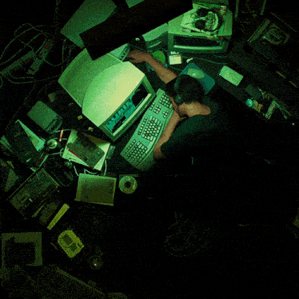

# 🧑🏽‍💻 Olá, eu sou o Rodrigo Melo dos Santos!

  Profissional de TI com mais de 10 anos de experiência, especializado em suporte técnico, infraestrutura, qualidade de software e automação de processos.  
  Atualmente atuo como <strong>Analista de QA e Automação na Azul Music</strong>, integrando atividades de testes automatizados, controle de qualidade e desenvolvimento de scripts para garantir processos eficientes, aplicando <strong>JavaScript</strong> e <strong>Python</strong>.

## Sobre mim

- 🎓 **Formado em Ciência da Computação**
- 💼 **10+ anos de experiência em TI** - Suporte técnico, infraestrutura e qualidade de software
- 🎵 **Analista de QA e Automação na Azul Music** - Testes automatizados, controle de qualidade e scripts de automação
- 🔧 **Especialista em automação** - Web Automation, testes automatizados e QA
- 🚀 **Foco atual**: Modernização de sistemas, automação de processos e infraestrutura em nuvem
- 📈 **Experiência em projetos**: Rollout, migração de sistemas, ERP e redes corporativas
- 🏆 **Visão estratégica** para otimização de processos e modernização tecnológica

---
<picture>
  <source media="(prefers-color-scheme: dark)" srcset="https://raw.githubusercontent.com/RodrigoMeloSantos/RodrigoMeloSantos/output/pacman-contribution-graph-dark.svg">
  <source media="(prefers-color-scheme: light)" srcset="https://raw.githubusercontent.com/RodrigoMeloSantos/RodrigoMeloSantos/output/pacman-contribution-graph.svg">
  
</picture>

---

## Tecnologias e linguagens 💻

### 🚀 Frameworks e ferramentas de automação

- 🎭 **Playwright** - Automação moderna de testes web
- 🔍 **Cypress** - Testes end-to-end
- 🐍 **Requests** - Biblioteca Python para requisições HTTP
- 🐼 **Pandas** - Manipulação e análise de dados
- 📡 **Postman** - Desenvolvimento e testes de APIs

### 🛠️ Ferramentas de desenvolvimento

<!-- Container flexível para imagem à esquerda e texto à direita -->

  <!-- Imagem com tamanho fixo à esquerda -->
  

    
  

  <!-- Texto à direita ocupando o restante do espaço -->
  

    

      Minha jornada em TI começou com <strong>suporte em microinformática e manutenção de redes</strong>, evoluindo para implantação de sistemas corporativos e automação de processos.  
      Na <strong>Azul Music</strong>, como Analista de QA e Automação, além de prestar suporte técnico aos clientes da aplicação Player Music Delivery, atuo no desenvolvimento de testes automatizados e scripts de qualidade, aplicando <strong>JavaScript e Python</strong> com ferramentas como Playwright e Cypress.  
      Tenho experiência sólida em <strong>qualidade de software (QA)</strong>, automação de testes, desenvolvimento de APIs e projetos de modernização de sistemas, sempre focando na eficiência e qualidade dos processos.
    

  

## 🎯 Experiência e Especialidades

### 🏢 **Analista de QA e Automação - Azul Music**
- 🎵 Suporte técnico para aplicação Player Music Delivery
- 💻 Desenvolvimento e aprimoramento de funcionalidades do sistema
- 🔍 Qualidade de software (QA) e testes automatizados
- 🐍 Desenvolvimento de scripts com JavaScript e Python

### 🔧 **Expertise Técnica**
- **Automação**: Web Automation, testes exploratórios, Playwright
- **APIs**: Desenvolvimento e testes com Postman
- **Modernização**: Atualização de sistemas operacionais, migração de ambientes

  Vamos nos conectar? Sou sempre aberto a discussões sobre automação, qualidade de software e modernização de sistemas! 💌✨

  
  
  

